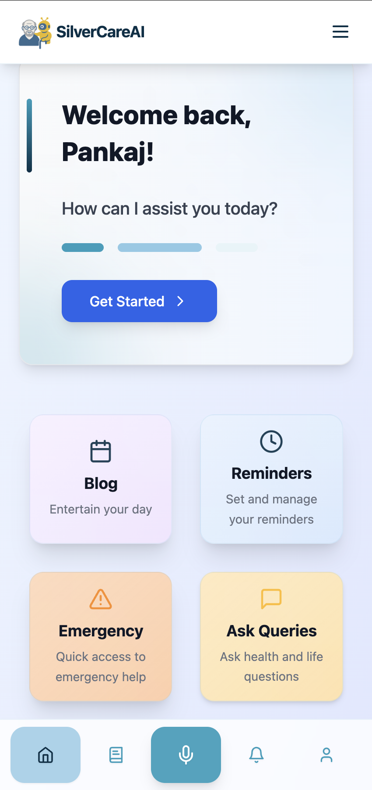
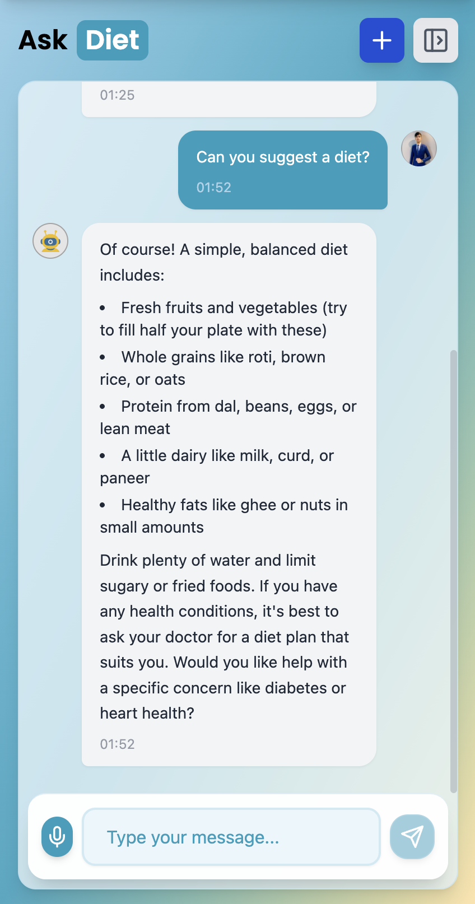
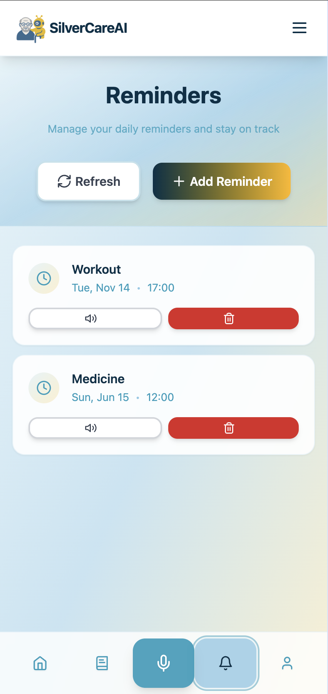
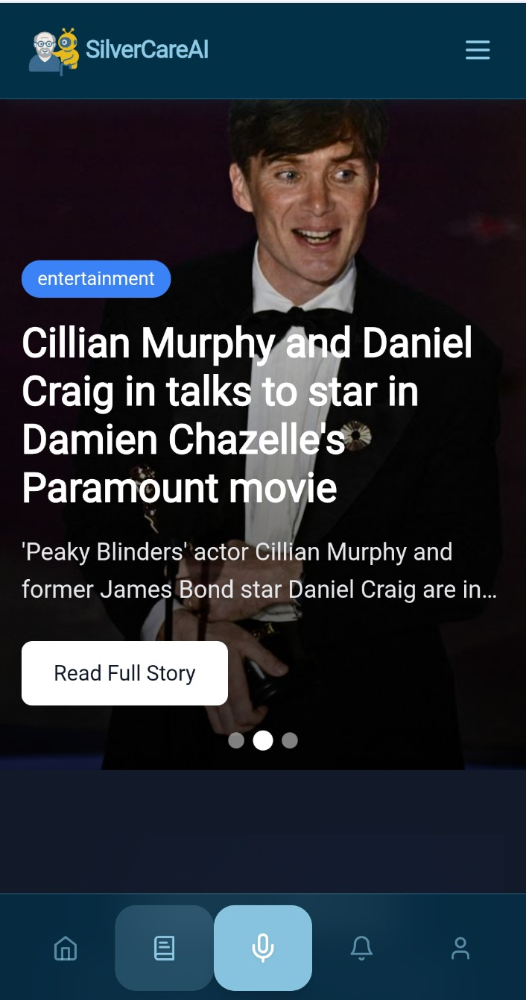
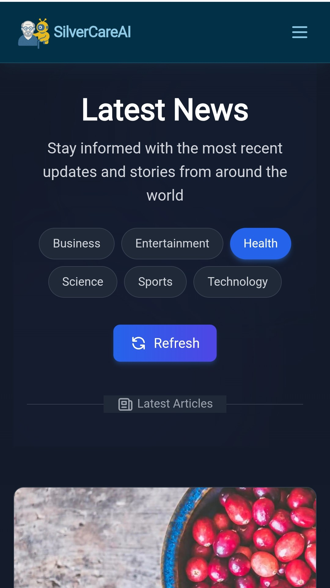
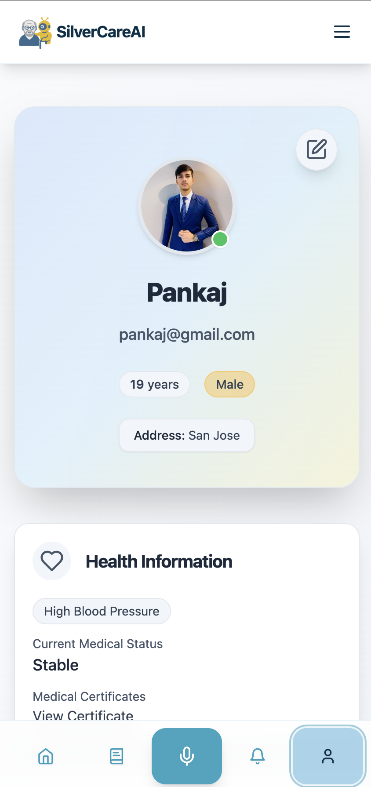
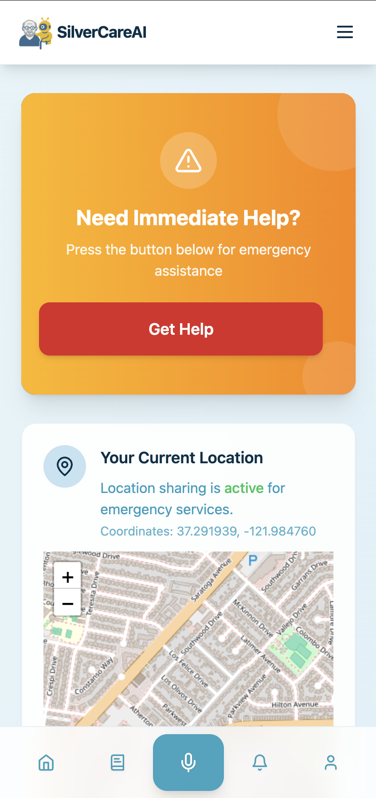

#  SilverCare-AI

---

<p align="center">
  
</p>

<p align="center">
  <b>Empowering Seniors with a Voice-First, Accessible AI Assistant.</b><br>
  <i>Chat, Reminders, Emergency Alerts and Accessibility—All in One Place.</i>
</p>

---

## 🌟 Overview

SilverCare-AI is a full-stack, voice-first AI assistant designed for senior citizens. It bridges the digital divide by making technology accessible, intuitive and empowering for older adults. With step-by-step onboarding, voice-enabled chat, smart reminders, emergency alerts and a beautiful, accessible UI, SilverCare-AI is more than a tool—it's a companion for independent living.

---

## 🖼️ Screenshots

<p align="center">
  
  
  
  
  
  
  
</p>

> **Note:** All screenshots above showcase the mobile-first, accessible design of SilverCare-AI. For best results, view on a mobile device or resize your browser window.

---

## 🛠️ Tech Stack

### Frontend

- **React + Vite**: Fast, modern and modular UI development.
- **Tailwind CSS**: Utility-first, accessible and responsive styling.
- **React Context & Hooks**: State management and custom logic.
- **Speech Recognition & Synthesis APIs**: Voice input/output everywhere.
- **Firebase Auth**: Secure authentication and user management.

### Backend

- **Python (Flask)**: REST API for chat, reminders, onboarding and emergency features.
- **Firebase Firestore**: User data, reminders and profile storage.
- **MongoDB**: Emergency contacts storage and reminders.
- **Vercel**: Serverless deployment for both frontend and backend.

---

## ✨ Features

- **Step-by-Step Onboarding**: Voice-enabled, mobile-friendly form with validation and accessibility.
- **Voice-First Chat**: Ask anything, set reminders, or get help—just speak!
- **Smart Reminders**: Create, view and get notified about reminders. Unique alarms, no duplicates and reliable scheduling.
- **Emergency Alerts**: Instantly send emergency alerts and manage emergency contacts.
- **Blog/News Section**: Fetches news using World News API (API key required).
- **Accessibility**: High-contrast, large touch targets, voice feedback and screen reader support.
- **Mobile-First Design**: Fully responsive and touch-friendly.
- **Personalization**: Learns and adapts to user interests and needs.

---

## ♿ Accessibility & Onboarding

- **Accessible by Design**: Every page and component is built for seniors—clear labels, voice feedback and easy navigation.
- **Voice Input Everywhere**: All forms and chat fields support voice input, with clear buttons and feedback.
- **Step Progress**: Onboarding shows clear progress and prevents skipping required steps.
- **Screen Reader Friendly**: Uses semantic HTML and ARIA where needed.

---

## 🔒 Security & Best Practices

- All API keys and credentials are stored in `.env` files (never hardcoded).
- Firestore rules restrict access to authenticated users where appropriate.
- No user passwords are stored—uses Firebase Auth only.
- All focus ring and focus state CSS have been removed for a cleaner UI.
- Margins and layout are standardized to prevent extra scroll.
- SEO meta tags are included in `index.html`.
- Error handling and user feedback are improved throughout the app.
- Filtered unused filetypes for optimised storage. 

---

## 🚀 Getting Started

### Prerequisites

- **Node.js** (v16+)
- **npm** or **yarn**
- **Python 3.9+**
- **pip** (Python package manager)

### Installation

1. **Clone the Repository**

   ```sh
   git clone <Repository-Link>
   cd <Repository-Name>
   ```

2. **Install Client Dependencies**

   ```sh
   cd client
   npm install
   # or
   yarn install
   ```

3. **Install Server Dependencies**

   ```sh
   cd ../server
   pip install -r requirements.txt
   ```

### Environment Variables

- All API keys and credentials must be set in `.env` files in both `client/` and `server/` directories.
- See `client/Readme.md` and `server/Readme.md` for example `.env` files and required variables.

### Running the Application

1. **Start the Backend (Flask Server)**

   ```sh
   cd server
   python app.py
   # or use flask run
   ```

2. **Start the Frontend (Vite/React)**

   ```sh
   cd client
   npm run dev
   # or
   yarn dev
   ```

3. **Access the App**
   Open your browser at [http://localhost:5173](http://localhost:5173) (default Vite port).

---

## 🗂️ Project Structure

- `client/` — Frontend React app ([see client/Readme.md](client/Readme.md))
- `server/` — Backend Python API ([see server/Readme.md](server/Readme.md))
- `public/` — Static assets (images, audio, etc.)
- `index.html` — Main HTML entry point (SEO/meta tags)

---

## 🔮 Future Enhancements

- **Mobile App**: Native iOS/Android support.
- **Smart Home Integration**: Voice control for IoT devices.
- **Health Monitoring**: Track vitals and provide insights.
- **Community & Social**: Connect seniors for social engagement.

---

## 👨‍💻 Contributors

| [](https://github.com/parthnarkar) | [](https://github.com/tanish-jain-225) | [](https://github.com/pankaj0695) | [](https://github.com/Chief-Ayush) |
| :--------------------------------------------------------------------------------: | :----------------------------------------------------------------------------------------: | :------------------------------------------------------------------------------: | :--------------------------------------------------------------------------------: |
|                 [**Parth Narkar**](https://github.com/parthnarkar)                 |                  [**Tanish Sanghvi**](https://github.com/tanish-jain-225)                  |                [**Pankaj Gupta**](https://github.com/pankaj0695)                 |                [**Ayush Attarde**](https://github.com/Chief-Ayush)                 |

---

## 🤝 Contributing

We welcome contributions! To get started:

1. Fork the repo.
2. Create a feature branch.
3. Submit a pull request with a clear description.

---

## 🏆 Why SilverCare-AI?

SilverCare-AI is more than a hackathon project—it's a mission to empower seniors with technology that truly understands and supports them. Our focus on accessibility, usability and real-world impact sets us apart. We believe every senior deserves a digital companion that is friendly, reliable and empowering.

---

<p align="center">
  <b>Making Technology Human—For Everyone.</b>
</p>
